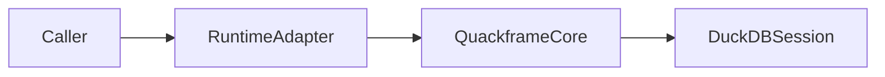

# Quackframe Documentation

## Overview

Use this skill to keep Quackframe documentation simple, architecture-focused,
and connected. Quackframe is an orchestrator-agnostic runtime for governed,
observable DuckDB SQL workflows. The Prefect runtime and Prefect-backed
credentials are optional integrations, not core identity.

Before substantial documentation work, read:

- `.agents/references/preferences.md`
- `.agents/references/code-style.md` when the docs describe implementation or
  testing behaviour

## Workflow

1. Read `docs/README.md` first to identify the correct documentation zone.
2. Edit the smallest set of docs that owns the subject. Regular docs under
   `docs/*.md` are developer-first usage and concept docs; epic docs under
   `docs/epics/**` are implementor-facing architecture, phase, and status docs.
3. Separate core contracts from optional integrations. Document Prefect,
   credential stores, and other external systems in their adapter or provider
   context rather than making them implicit core dependencies.
4. Add or update `Related Docs` links so readers can move laterally between
   connected topics.
5. Update `docs/README.md` whenever adding, renaming, or removing a document.
6. Keep `README.md` short; it should introduce the project and point to the
   documentation index rather than duplicate the architecture.
7. For implementation tracking, keep epic phase files under
   `docs/epics/[number]-[short-desc]/[phase-no]-[short-desc].md`.
8. Run outcome-based validation before handing off.

## Documentation Zones

Regular docs should help developers use and reason about Quackframe. Epic docs
should help implementors build it. Create only the zones the project has earned.

- `docs/overview.md`: identity, goals, non-goals, philosophy, and MVP stance.
- `docs/developer-api.md`: public Python and command-line contracts.
- `docs/developer-examples.md`: concise direct and adapter-backed examples.
- `docs/execution-lifecycle.md`: ordered-file execution, session ownership,
  failure, and cleanup semantics.
- `docs/runtime-adapters.md`: direct execution and optional runtime integrations.
- `docs/python-extensions.md`: SQL-callable Python functions and registration.
- `docs/credential-providers.md`: replaceable credential sources and safe secret
  handling as one extension use case.
- `docs/configuration.md`: core settings and integration-specific configuration.
- `docs/mad-utilities-duckdb-reference.md`: prototype evidence and migration
  reference, not an inherited production contract.
- `docs/roadmap.md`: phases, acceptance criteria, open decisions, and future
  work boundaries.
- `docs/epics/**`: implementor-facing architecture and phase tracking with
  status headers, scope, design notes, checklists, validation, and follow-ups.

## Epic Phase Files

Use epic phase docs for implementation architecture and phase tracking, not
developer-facing usage guidance. Each phase file must start with:

```markdown
# Phase Title

Status: **Planned**
Last updated: YYYY-MM-DD
Epic: 01 Short Name
Phase: 01
Related docs: [Roadmap](../../roadmap.md)
```

Allowed statuses are `Planned`, `In Progress`, `Blocked`, and `Complete`.
Before handing back after a relevant coding task, update the status header for
each touched phase. If scope changes but status does not, still update
`Last updated` and note the change in the phase body.

## Mermaid Diagrams

Add a Mermaid diagram when it explains flow, ownership, extension boundaries,
or state transitions better than prose. Prefer diagrams for:

- core execution and shared-session lifecycle;
- local and adapter-backed runtime paths;
- core, runtime-adapter, observer, and provider ownership;
- SQL-callable Python extension registration;
- execution state and failure transitions;
- configuration precedence.

Do not add a diagram for wording changes or short option lists. Keep diagrams
small enough to maintain by hand.

Use fenced Mermaid blocks:

````markdown

````

Diagram rules:

- Use stable, descriptive node names.
- Prefer `flowchart LR` for pipelines and `sequenceDiagram` for interactions.
- Keep labels concise and ASCII-only.
- Pair every diagram with enough prose that the document remains useful
  without rendering support.
- Avoid styling-heavy Mermaid unless it communicates architecture.
- Review Mermaid syntax by inspection unless dedicated tooling is introduced.

## Knowledge Graph Links

Treat the docs like a small knowledge graph. Every active architecture doc
should link to the docs a reader is likely to need next.

Use a `## Related Docs` section when a page has multiple neighbours. Prefer
links that explain the relationship:

```markdown
- [Runtime Adapters](runtime-adapters.md): how external runtimes wrap
  the core execution lifecycle.
```

Do not link every page to every other page. Link by conceptual adjacency:
developer API to examples and lifecycle, lifecycle to adapters and extensions,
extensions to credential providers, and roadmap to the major work tracks.

## Style Rules

- Follow `.agents/references/preferences.md` for product direction and workflow.
- Keep Quackframe core independent of Prefect and other orchestrators.
- Describe Prefect as an optional runtime adapter, not the core identity.
- Describe Prefect Blocks as one credential-provider implementation, not the
  credential contract.
- Keep SQL as the primary authoring surface and Python as the execution and
  extension frame.
- Write for a general public audience. Do not prescribe MAIT DEV repository
  naming, customer tenancy, internal infrastructure, or organizational
  conventions to downstream users.
- Use neutral repository and path examples that demonstrate Quackframe without
  implying that consumers must adopt an unrelated project structure.
- Prefer concrete contracts, function names, and file paths over vague prose.
- Distinguish accepted Quackframe direction from behaviour merely observed in
  the `MAD.Utilities.DuckDB` prototype.
- Keep examples short and move extended examples to
  `docs/developer-examples.md`.

## Validation

Before final response, run the checks that fit the change:

```bash
rg -n "Prefect.*(required|core)|core.*Prefect|credential.*core goal" README.md docs examples
python .agents/skills/quackframe-documentation/scripts/check_doc_links.py
git diff --check
```

Expected outcomes:

- Review terminology scan hits individually. Accepted text may explain a
  prohibited coupling or an optional integration, but active docs must not
  present Prefect or credential management as Quackframe's core identity.
- The link check must report that all local Markdown files and heading anchors
  exist.
- `git diff --check` must exit cleanly.

Report that the work is docs-only unless code or tests changed.
