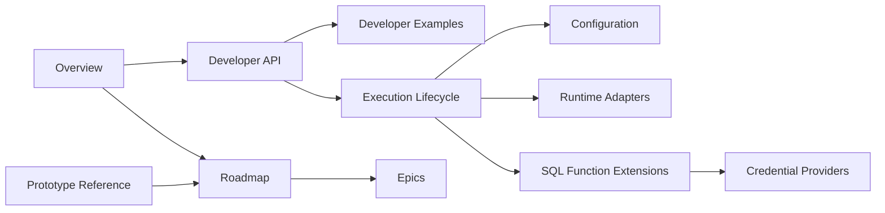

# Quackframe Documentation

Quackframe is a Python runtime for extending and executing DuckDB SQL
workflows. These documents separate the stable core from optional runtime and
service integrations.

## Architecture

- [Overview](overview.md): project identity, goals, boundaries, and design
  philosophy.
- [Developer API](developer-api.md): command-line, VS Code F5, and Python entry
  points.
- [Execution Lifecycle](execution-lifecycle.md): configuration, DuckDB session,
  ordered SQL execution, results, and failures.
- [Configuration](configuration.md): the boundary between checked-in TOML,
  environment values, native integration settings, and invocation overrides.
- [Runtime Adapters](runtime-adapters.md): direct execution and optional
  runtimes such as Prefect.
- [SQL Function Extensions](python-extensions.md): how self-contained Python
  functions become `quackframe.<function_name>` SQL calls.
- [Credential Providers](credential-providers.md): credential resolution as one
  optional SQL-function use case.
- [Prototype Reference](mad-utilities-duckdb-reference.md): evidence retained
  from the earlier prototype without inheriting its coupling.
- [Roadmap](roadmap.md): delivered MVP phases, acceptance criteria, and
  post-MVP decisions.
- [Epics](epics/README.md): implementor-facing phase tracking.
- [SQL Result Logging Scope](epics/02-result-logging/01-sql-result-logging.md):
  planned statement selection and direct or Prefect log delivery.

## Knowledge Map

Start with the [Overview](overview.md), then follow the topic that owns the
decision or implementation work in front of you.

## Examples

- [Developer Examples](developer-examples.md): concise commands and Python
  usage.
- [Runnable Example Layouts](../examples/README.md): neutral downstream project
  shapes for direct, ordered, and Prefect-observed execution.

## Documentation Status

The MVP contract is implemented in `src/quackframe`. The phase documents record
the initial implementation and its validation boundaries; the roadmap now
separates delivered MVP behaviour from post-MVP work.
