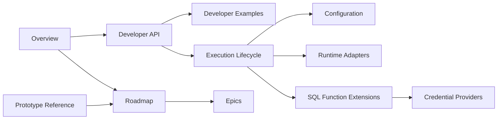

# Quackframe Documentation

Quackframe is a Python runtime for extending and executing DuckDB SQL
workflows. These documents separate the stable core from optional runtime and
service integrations.

## Architecture

- [Overview](overview.md): project identity, goals, boundaries, and design
  philosophy.
- [Developer API](developer-api.md): command-line, VS Code F5, and Python entry
  points.
- [Execution Lifecycle](execution-lifecycle.md): configuration, DuckDB session,
  ordered SQL execution, results, and failures.
- [Configuration](configuration.md): the boundary between checked-in TOML,
  environment values, native integration settings, and invocation overrides.
- [Runtime Adapters](runtime-adapters.md): direct execution and optional
  runtimes such as Prefect.
- [SQL Function Extensions](python-extensions.md): how self-contained Python
  functions become `quackframe.<function_name>` SQL calls.
- [Credential Providers](credential-providers.md): credential resolution as one
  optional SQL-function use case.
- [Filesystems](filesystems.md): SFTP and Azure registration, endpoint semantics and backend lifetime.
- [Prototype Reference](mad-utilities-duckdb-reference.md): evidence retained
  from the earlier prototype without inheriting its coupling.
- [Roadmap](roadmap.md): delivered MVP phases, acceptance criteria, and
  post-MVP decisions.
- [Epics](epics/README.md): implementor-facing phase tracking.
- [Versioning And Releases](releases.md): branch roles, compatibility, automatic
  publishing, owner setup and recovery.
- [SQL Result Logging Scope](epics/02-result-logging/01-sql-result-logging.md):
  implemented statement selection, native DuckDB rendering, and safe runtime
  delivery.
- [Dotenv Configuration Scope](epics/03-configuration/01-dotenv-loading.md):
  implemented runtime-root `.env` loading for Quackframe-owned settings.

- [Shared Credential Loading And fsspec Scope](epics/04-filesystems/01-shared-credential-loading-and-fsspec.md): implemented shared credential loading and SFTP registration.
- [Named Filesystem Protocol Scope](epics/04-filesystems/02-aliased-filesystem-registrations.md): multiple independently configured filesystems selected by named protocols, with explicit cleanup.
- [Azure Filesystem Scope](epics/04-filesystems/03-azure-filesystem-strategies.md): strategies using existing Azure connection-string and managed-identity credentials, with validation status.
- [Filesystem Write Scope](epics/04-filesystems/04-filesystem-write-support.md): write contract, implementation and validation for every registered filesystem strategy.

- [Semantic Versioning And Publication Scope](epics/05-releases/01-semantic-versioning-and-publication.md): automatic RCs, stable promotion and patch releases; repository implementation with external activation outstanding.

- [Prefect Deployment Scope](epics/06-prefect-deployment/01-deployment-entry-point.md): public Quackframe flow, native deployment, and execution-environment SQL paths, with validation evidence.

- [Parameterized SQL Scope](epics/07-parameterized-sql/01-parameter-binding-and-sql-invocation.md): proposed shared binding, per-file Python inputs and SQL-driven file execution.

## Knowledge Map

```mermaid
flowchart LR
  Overview --> DeveloperAPI[Developer API]
  DeveloperAPI --> Examples[Developer Examples]
  DeveloperAPI --> Lifecycle[Execution Lifecycle]
  Lifecycle --> Configuration
  Lifecycle --> RuntimeAdapters[Runtime Adapters]
  Lifecycle --> SQLFunctions[SQL Function Extensions]
  SQLFunctions --> CredentialProviders[Credential Providers]
  Prototype[Prototype Reference] --> Roadmap
  Overview --> Roadmap
  Roadmap --> Epics
```

Start with the [Overview](overview.md), then follow the topic that owns the
decision or implementation work in front of you.

## Examples

- [Developer Examples](developer-examples.md): concise commands and Python
  usage.
- [Runnable Example Layouts](../examples/README.md): neutral downstream project
  shapes for direct, ordered, and Prefect-observed execution.

## Documentation Status

The MVP contract is implemented in `src/quackframe`. The phase documents record
the initial implementation and its validation boundaries; the roadmap now
separates delivered MVP behaviour from post-MVP work.
