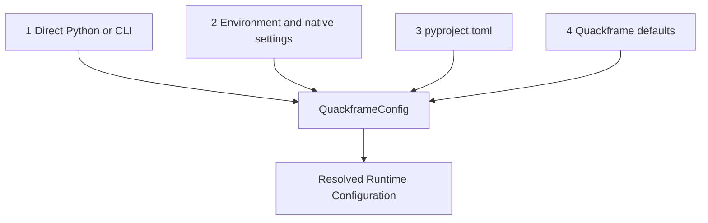

# Configuration

Quackframe configuration is owned by a typed `QuackframeConfig` model.
`pyproject.toml`, environment variables, native integration settings, CLI
arguments, and direct Python values are inputs to that model; they are not
independent sources of runtime truth.

## Configuration Boundary

Use this decision rule:

| Value | Authoritative input |
| --- | --- |
| Stable behaviour every clone should inherit | `pyproject.toml` |
| Machine-, deployment-, identity-, or environment-specific value | Environment or native integration profile |
| Credential or sensitive metadata | Native secure mechanism or injected environment |
| Deliberate exception for one invocation | CLI or direct Python value |

Checked-in configuration describes project intent. It must not contain secret
values, private keys, individual identities, machine-specific absolute paths,
or sensitive endpoints that the project does not intend to disclose.

## Canonical Model

The proposed top-level shape is:

```text
QuackframeConfig
  root
  runtime
  database
    mode
    path
  functions
    enabled
  duckdb
    settings
    extensions
  integrations
```

The exact public fields remain subject to implementation review. Function
packages may define their own namespaced configuration without forcing unrelated
functions to adopt a shared thematic model.

## Repository Configuration

An explicit persistent example is:

```toml
[tool.quackframe]
runtime = "direct"

[tool.quackframe.database]
mode = "persistent"
path = ".quackframe/example.duckdb"

[tool.quackframe.functions]
enabled = []
```

`pyproject.toml` is the default project input because a downstream Python
project already uses it for dependencies and tool configuration. Hydra or
another composition system may be supported later as an adapter that produces
the same `QuackframeConfig` model.

Do not use `pyproject.toml` as a workflow-definition file. SQL file order remains
an invocation concern until a separate job-manifest contract is deliberately
designed.

## Runtime Root And Relative Paths

The runtime root defaults to `Path.cwd()` when the caller supplies no root.
Relative database, temporary, and configuration paths resolve from the runtime
root.

For VS Code F5:

```json
"cwd": "${workspaceFolder}"
```

makes the workspace folder the predictable default root. A scheduler should set
its working directory explicitly or provide a root override.

## Environment Inputs

Quackframe-owned settings may have `QUACKFRAME_` environment equivalents where
deployment overrides are useful, for example:

```text
QUACKFRAME_ROOT
QUACKFRAME_RUNTIME
QUACKFRAME_DATABASE_PATH
DUCKDB_TEMP_DIRECTORY
```

Quackframe should not create aliases for every setting owned by another
product. Optional adapters should first respect that product's native
environment and profile model.

## Prefect Settings

A project may choose the Prefect runtime without checking in connection details:

```toml
[tool.quackframe]
runtime = "prefect"
```

The Prefect integration respects native settings such as:

```text
PREFECT_API_URL
PREFECT_API_KEY
```

An API URL is not necessarily a credential, but it may disclose private
hostnames, network topology, environment names, or tenant information. Public
examples should therefore prefer Prefect environment variables or profiles.

Quackframe may support a checked-in default:

```toml
[tool.quackframe.integrations.prefect]
api_url = "https://prefect.example.com/api"
```

only when the repository intentionally shares that endpoint. API keys and
credential values are never valid checked-in configuration.

The shared `integrations.prefect` section is available to both the Prefect
runtime and Prefect-backed function providers. Runtime-specific presentation
settings belong under `runtimes.prefect` if they are later required.

## Precedence



Higher-numbered sources supply values only when a higher-precedence source does
not. Every source is validated through the same typed model.

## Open Decisions

- Whether the default database mode is `memory`, `temporary`, or `persistent`.
- The derived database path when no explicit path is configured.
- Whether the runtime root can be discovered from a parent `pyproject.toml` or
  is always exactly the invocation working directory.
- The minimum useful DuckDB settings surface for the MVP.
- Whether Quackframe needs any Prefect-specific values beyond native Prefect
  settings during the MVP.

## Related Docs

- [Overview](overview.md): the framework-independent product stance.
- [Developer API](developer-api.md): CLI and Python overrides.
- [Execution Lifecycle](execution-lifecycle.md): when configuration is applied.
- [Runtime Adapters](runtime-adapters.md): integration-specific settings.
