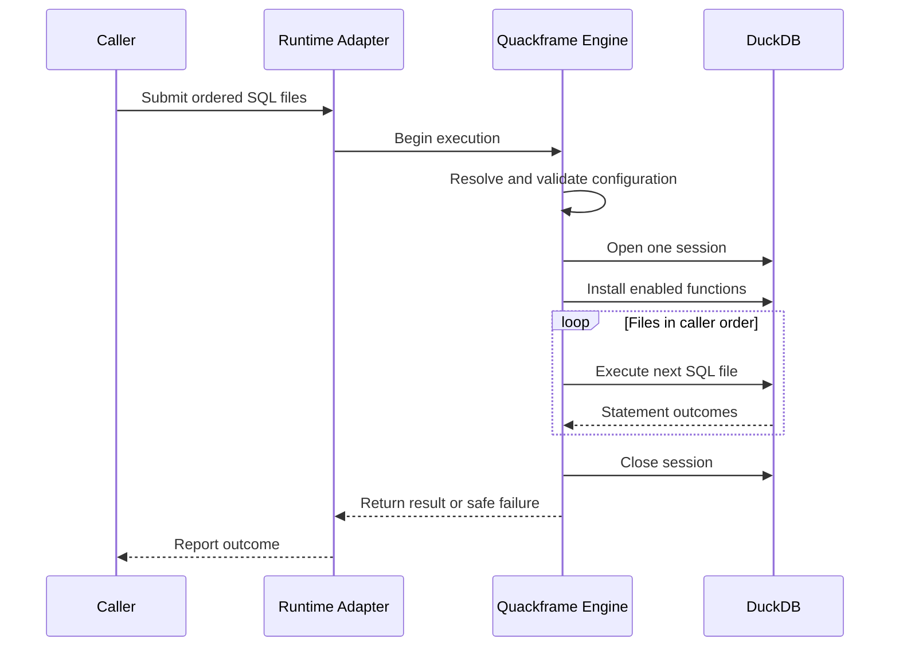

# Execution Lifecycle

Every supported entry point delegates to the same Quackframe execution
lifecycle. Runtime adapters may observe and represent that lifecycle, but they
must not redefine it silently.

## Lifecycle

The happy path is:

1. Accept a non-empty, ordered list of SQL files.
2. Resolve `QuackframeConfig` from defaults, repository configuration,
   environment, and explicit overrides.
3. Validate paths, runtime availability, database lifecycle, and enabled
   functions before executing SQL.
4. Ask the selected runtime adapter to represent the invocation.
5. Open one DuckDB session owned by the invocation.
6. Create the reserved `quackframe` SQL schema and install enabled function
   macros over private Python UDFs.
7. Execute each SQL file in caller-supplied order without closing the session.
8. Stop on the first failure and attach safe file and statement context.
9. Close the session and apply the configured database lifecycle.
10. Return a typed result or raise a typed execution error.

## Session Invariants

- One invocation owns one DuckDB session.
- Files execute serially in the supplied order.
- Session state created by an earlier file is visible to later files.
- F5 supplies one active file and receives the same lifecycle.
- No runtime adapter may move a file to a different process or session unless a
  future contract explicitly changes the shared-session invariant.
- Function installation completes before project SQL begins.
- The runner delegates installation through one function-neutral registrar and
  never branches on concrete function names or function-specific request types.
- Quackframe closes the session even when execution fails.

## SQL-file Behaviour

The engine validates that each input exists and is an SQL file. Empty files
fail clearly. Each file is separated into DuckDB statements using DuckDB's own
parser rather than string splitting.

By default, diagnostics may include:

- execution and file start or completion;
- statement number and completion state;
- scalar result name and value only when explicitly safe;
- returned-row counts rather than arbitrary result sets;
- elapsed time and the final process outcome.

Diagnostics must not include credentials, bound secret values, full SQL text,
or arbitrary returned query data by default.

## Failure Contract

A SQL failure stops subsequent files. The failure should identify:

- the SQL file;
- the one-based statement number when known;
- a safe reason supplied by DuckDB or the failing extension;
- the overall failed outcome and non-zero CLI exit code.

Runtime adapters may enrich the failure with their own run identifier, but the
core exception remains framework-independent.

## Database Lifecycle

The intended configuration distinguishes three concepts:

- `memory`: one in-memory database for the invocation;
- `temporary`: a Quackframe-managed file removed according to an explicit,
  safe lifecycle;
- `persistent`: a caller-owned or project-owned file that Quackframe never
  deletes implicitly.

The runtime root defaults to the current working directory. The default mode,
derived filename, and temporary cleanup details remain open MVP decisions.

## Related Docs

- [Developer API](developer-api.md): how callers start this lifecycle.
- [Configuration](configuration.md): how paths, modes, and adapters resolve.
- [Runtime Adapters](runtime-adapters.md): how external systems observe runs.
- [SQL Function Extensions](python-extensions.md): what is installed before SQL.
