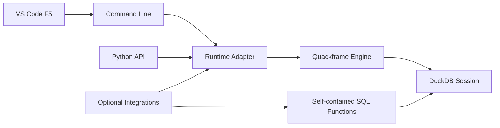

# Quackframe Overview

Quackframe is an orchestrator-agnostic Python runtime for governed, observable
DuckDB SQL workflows. SQL remains the primary authoring surface. Python frames
execution, provides deliberate extension points, and connects optional runtime
and service integrations.

## What Quackframe Is

Quackframe runs one or more explicitly ordered SQL files in a shared DuckDB
session. It gives the same core behaviour to three developer entry points:

1. the `quackframe run` command;
2. Visual Studio Code F5 execution through a thin `launch.json` wrapper; and
3. a Python API for embedding the engine in applications, notebooks, or tests.

Command-line execution is also the automation entry point for schedulers. It is
not a separate execution model.

Quackframe can install self-contained Python functions into the active DuckDB
session. Downstream SQL calls them through a `quackframe` schema, while the
underlying connection-scoped Python UDFs remain private implementation details.

## What Quackframe Is Not

Quackframe is not:

- a workflow DAG engine or scheduler;
- tied to Prefect or another orchestrator;
- a credential store;
- a copy-specific data movement framework;
- the owner of project-specific SQL or repository naming conventions;
- a system that infers file order or dependencies from paths and filenames.

Credential resolution is one useful SQL-function extension. It is not the
organising purpose of the project.

## Architecture

The engine owns configuration resolution, session lifecycle, function
installation, ordered execution, failure semantics, and results. Runtime
adapters wrap execution without redefining those behaviours. Optional service
integrations may support a runtime adapter, a SQL function, or both.

## Design Principles

**SQL first.** Business behaviour remains visible as ordinary, reviewable
DuckDB SQL.

**One execution contract.** CLI, F5, Python, and scheduled invocation converge
on the same engine.

**Explicit order.** Caller-supplied file order is authoritative. All files in
one invocation share one DuckDB session.

**Framework-independent core.** Core execution works without Prefect or any
other optional integration installed.

**Adapter fidelity.** Runtime adapters must not silently introduce retries,
caching, concurrency, reordered files, or different cleanup behaviour.

**Function autonomy.** Each SQL-callable function is a self-contained unit of
work. Limited duplication is preferable to restrictive coupling between
otherwise independent functions.

**Public by default.** Documentation and examples use neutral terminology and
do not prescribe an organisation's repository names, infrastructure, or
deployment conventions.

## Configuration Stance

A typed `QuackframeConfig` model is the canonical configuration contract.
`pyproject.toml`, environment variables, integration-native settings, CLI
arguments, and direct Python values are inputs to that model.

The runtime root defaults to the current working directory. This makes
`cwd: ${workspaceFolder}` sufficient for predictable F5 execution. The exact
default database lifecycle and derived file location remain open decisions.

## MVP Stance

The MVP should prove:

- configuration loading and root-relative path resolution;
- one DuckDB session per invocation;
- explicit ordered SQL-file execution with safe failures;
- CLI, F5, and Python entry points;
- self-contained SQL function registration and macro namespacing;
- direct execution without optional integrations;
- Prefect as an optional runtime adapter; and
- Prefect-backed MSSQL and Azure connection-string credentials as initial
  provider examples, not core dependencies.

## Related Docs

- [Developer API](developer-api.md): the proposed public entry points.
- [Execution Lifecycle](execution-lifecycle.md): the invariants behind every
  entry point.
- [Configuration](configuration.md): how settings are resolved.
- [Runtime Adapters](runtime-adapters.md): how runtime selection remains optional.
- [SQL Function Extensions](python-extensions.md): the autonomous function
  model.
- [Roadmap](roadmap.md): proposed implementation order.
