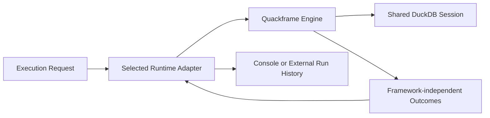

# Runtime Adapters

Runtime adapters determine how an execution is represented and observed. They
do not own DuckDB execution semantics.

## Contract



Every adapter must preserve:

- one shared DuckDB session per invocation;
- serial caller-supplied file order;
- fail-fast execution;
- function installation before project SQL;
- core database lifecycle and cleanup behaviour;
- framework-independent results and exceptions.

An adapter must not silently enable retries, caching, concurrency, deferred
execution, or cross-process task execution.

## Direct Runtime

`direct` executes in the current Quackframe process and reports to
the terminal or Python caller. It does not mean that data sources, database
files, or credential providers must be local.

Direct execution remains a first-class path and must work without Prefect
or another optional runtime dependency installed.

Selected SQL results are rendered with DuckDB's native relation representation
and written to the terminal. Direct output does not require external-result
permission.

## Prefect Runtime

The optional Prefect adapter provides:

- one Prefect flow run for the Quackframe invocation;
- one filename-named Prefect task run for each SQL file;
- Prefect logging, timing, state, and failure visibility;
- the same shared connection and file order as direct execution.

Selected SQL results are written from inside the corresponding file task with
Prefect's run logger. Because that logging system may retain values, the runtime
requires explicit external-result permission before project SQL executes and
emits one retention warning when result logging is enabled.

Prefect decorators live only in the optional integration package. Static,
decorated functions wrap the existing core entry points:

```python
@task(cache_policy=NO_CACHE, retries=0, persist_result=False)
def execute_sql_file_task(connection, sql_file):
    return execute_sql_file(connection, sql_file)


@flow(retries=0, persist_result=False)
def execute_plan_flow(sql_files, config):
    return execute_plan(sql_files, config, execute_file=_execute_named_file_task)
```

The Prefect flow has the fixed name `quackframe-run` because it represents the
stable Quackframe execution process. When Quackframe loads a downstream
`[project].name` from `pyproject.toml`, it uses that value as the Prefect flow
run name. If no project name is available, Quackframe leaves the run name unset
and lets Prefect generate it.

Each SQL-file task is named from that file's path stem. Full paths remain in
execution results and failures, where they provide useful diagnostic context.
Quackframe never derives flow or flow-run identity from SQL filenames,
timestamps, runtime folders, or generated random values.

The dependency direction remains one-way: Prefect depends on Quackframe core;
Quackframe core does not import Prefect.

## Packaging

The initial distribution may keep the adapter in this repository as an
optional dependency:

```text
quackframe
quackframe[prefect]
```

Installing base Quackframe must not install Prefect. Selecting the Prefect
runtime without its optional dependency should fail with an actionable message.
Quackframe supports Prefect 3.2 and later 3.x releases. A downstream project
should pin a compatible client version that aligns with its Prefect server.
A separate distribution can be introduced later if release cadence or
dependency isolation earns that boundary.

Runtime names, implementation loaders, missing-dependency messages, and the
result-log destination policy live in one explicit registry. Configuration
validation and command-line choices read the public names from that registry.
The external-result permission is therefore driven by an adapter capability,
not by treating every runtime name other than `direct` alike. Adding a runtime
requires its implementation and one registry entry rather than coordinated
name branches in the CLI, configuration model, and selector.

## Prefect Connection Settings

The adapter should respect Prefect's native profile and environment settings.
Shared, non-sensitive project defaults may come from
`tool.quackframe.integrations.prefect`, but private endpoints and API keys stay
outside public checked-in configuration.

Prefect credential providers and the Prefect runtime may reuse the same
resolved Prefect client settings. Neither capability requires the other.

## Future Adapters

A future adapter should be able to implement the same small contract without
changing SQL, the CLI, or the core result types. Support is earned by a concrete
integration need rather than by anticipating every orchestrator.

## Related Docs

- [Execution Lifecycle](execution-lifecycle.md): the behaviour adapters preserve.
- [Configuration](configuration.md): runtime selection and native settings.
- [Developer API](developer-api.md): how callers select an adapter.
- [Credential Providers](credential-providers.md): a separate service-integration
  boundary.
