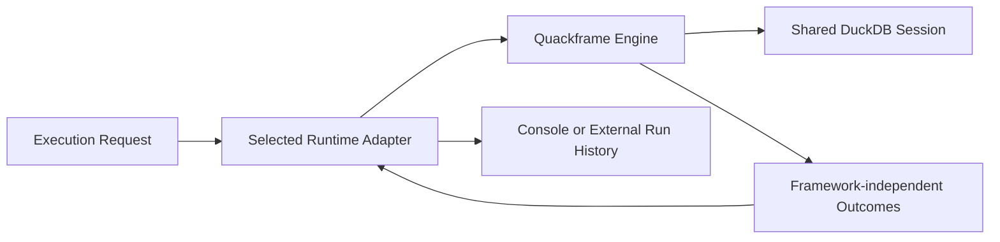

# Runtime Adapters

Runtime adapters determine how an execution is represented and observed. They
do not own DuckDB execution semantics.

## Contract



Every adapter must preserve:

- one shared DuckDB session per invocation;
- serial caller-supplied file order;
- fail-fast execution;
- function installation before project SQL;
- core database lifecycle and cleanup behaviour;
- framework-independent results and exceptions.

An adapter must not silently enable retries, caching, concurrency, deferred
execution, or cross-process task execution.

## Direct Runtime

`direct` executes in the current Quackframe process and reports to
the terminal or Python caller. It does not mean that data sources, database
files, or credential providers must be local.

Direct execution remains a first-class path and must work without Prefect
or another optional runtime dependency installed.

## Prefect Runtime

The optional Prefect adapter provides:

- one Prefect flow run for the Quackframe invocation;
- one filename-named Prefect task run for each SQL file;
- Prefect logging, timing, state, and failure visibility;
- the same shared connection and file order as direct execution.

Prefect decorators live only in the optional integration package. The wrappers
delegate execution to core functions:

```python
@task(task_run_name="{sql_file.stem}", cache_policy=NO_CACHE)
def execute_sql_file_task(session, sql_file):
    return execute_sql_file(session, sql_file)


@flow
def run_sql_files_flow(execution):
    return run_execution(execution, execute_file=execute_sql_file_task)
```

The exact implementation may differ, but the dependency direction may not:
Prefect depends on Quackframe core; Quackframe core does not import Prefect.

## Packaging

The initial distribution may keep the adapter in this repository as an
optional dependency:

```text
quackframe
quackframe[prefect]
```

Installing base Quackframe must not install Prefect. Selecting the Prefect
runtime without its optional dependency should fail with an actionable message.
A separate distribution can be introduced later if release cadence or
dependency isolation earns that boundary.

## Prefect Connection Settings

The adapter should respect Prefect's native profile and environment settings.
Shared, non-sensitive project defaults may come from
`tool.quackframe.integrations.prefect`, but private endpoints and API keys stay
outside public checked-in configuration.

Prefect credential providers and the Prefect runtime may reuse the same
resolved Prefect client settings. Neither capability requires the other.

## Future Adapters

A future adapter should be able to implement the same small contract without
changing SQL, the CLI, or the core result types. Support is earned by a concrete
integration need rather than by anticipating every orchestrator.

## Related Docs

- [Execution Lifecycle](execution-lifecycle.md): the behaviour adapters preserve.
- [Configuration](configuration.md): runtime selection and native settings.
- [Developer API](developer-api.md): how callers select an adapter.
- [Credential Providers](credential-providers.md): a separate service-integration
  boundary.
